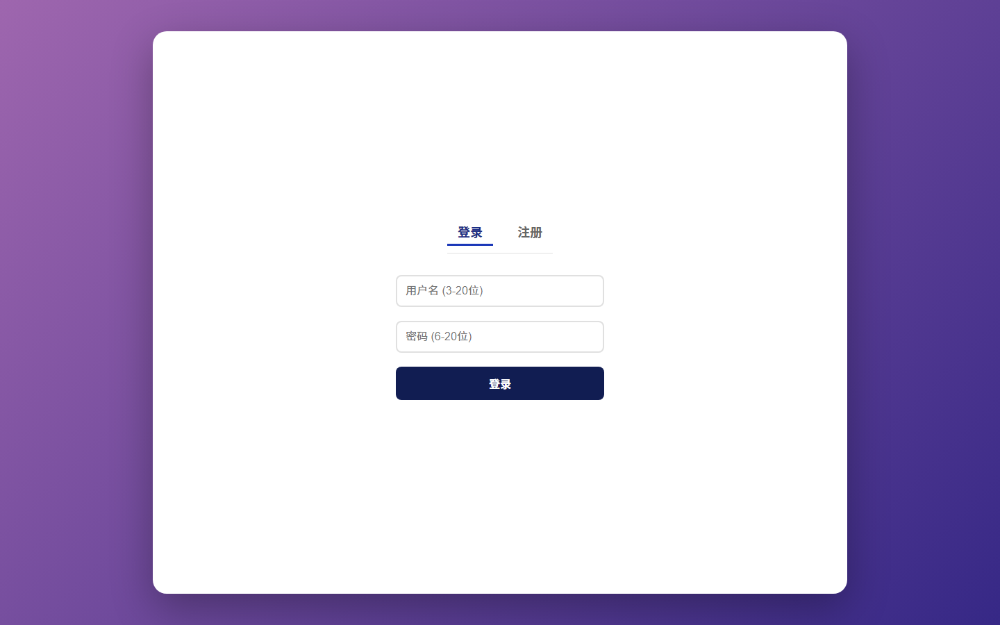
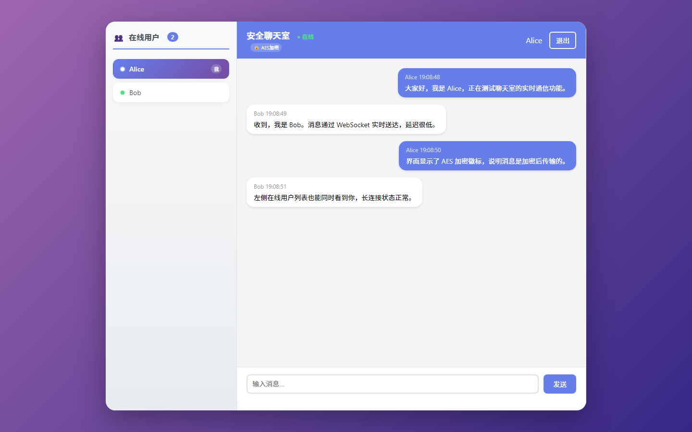
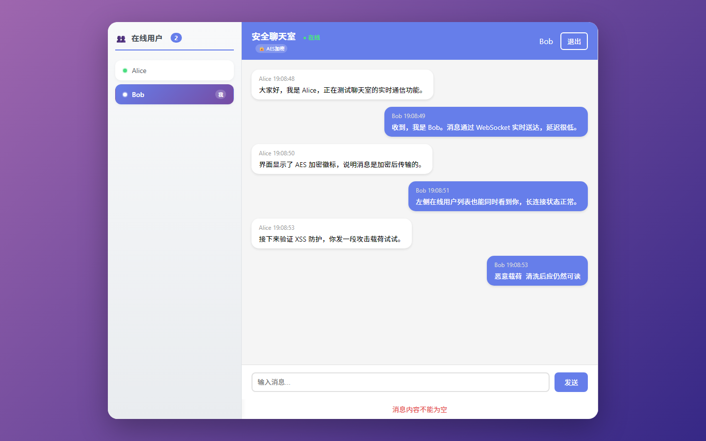

# chat_room · Web 安全聊天室

> 基于 Node.js + MySQL + Socket.IO 搭建的实时通讯聊天室，以 Web 安全防护为核心，重点实现对 SQL 注入与存储型 XSS 的防御，并完成注册登录、实时聊天、非法内容过滤等业务功能。


[](https://github.com/341-code/chat_room/actions/workflows/ci.yml)

## 项目简介

本系统为防 SQL 注入与 XSS 攻击的 Web 聊天室系统，采用 Node.js + Express 搭建后端服务，Socket.IO 实现实时消息通信，MySQL 作为数据库存储。系统具备用户注册登录、实时通信、消息加密传输、XSS 防护、SQL 注入防护等功能，整体采用 MVC 分层架构，结构清晰、安全性高、便于部署与维护。

## 功能特性

- 用户注册 / 登录 / 注销，口令使用 bcrypt 加盐哈希存储，数据库中不存明文
- 基于 Socket.IO 长连接的实时聊天与在线用户列表，支持多用户同时在线通信
- 聊天记录通过 Sequelize 持久化到 MySQL
- 消息在广播与落库前完成 XSS 清洗与非法内容过滤
- 消息内容经 AES 加密后传输
- Jest 单元测试覆盖 SQL 注入与 XSS 攻击用例

## 安全设计

| 威胁 | 防护措施 | 代码位置 |
| --- | --- | --- |
| SQL 注入 | Sequelize ORM 参数化查询，杜绝字符串拼接 SQL；用户名与消息内容做白名单清洗 | `models/`、`utils/xss-clean.js` |
| 存储型 XSS | DOMPurify + JSDOM 服务端清洗，拦截 `<script>`、事件属性、变形标签与编码绕过等载荷 | `utils/xss-clean.js` |
| DOM 型 XSS | 前端使用 `textContent` 渲染消息，避免 `innerHTML` 直接插入用户内容 | `public/index.html` |
| 口令泄露 | bcrypt 加盐哈希（10 轮），不存储明文口令 | `utils/password-encrypt.js` |
| 传输嗅探 | 消息内容 AES 加密后再传输 | `utils/encryption.js` |
| 密钥硬编码 | 数据库口令与加密密钥改为从环境变量读取 | `config/db.config.js`、`.env` |
| 会话劫持 / 跨站 | session cookie 设置 `httpOnly`，CORS 与 Socket.IO 限定来源 | `server.js`、`config/socket.config.js` |
| 大包拒绝服务 | Socket.IO 限制单条消息体积（`maxHttpBufferSize`） | `config/socket.config.js` |

## 技术栈

| 层次 | 选型 |
| --- | --- |
| 后端 | Node.js、Express 4、Socket.IO 4 |
| 数据层 | MySQL 8、Sequelize 6 |
| 安全 | bcryptjs、crypto-js（AES）、DOMPurify + JSDOM |
| 测试 | Jest、Supertest |
| 前端 | 原生 HTML / CSS / JavaScript（`public/index.html`） |

## 快速开始

### 1. 开发与运行环境

| 软件 | 版本 | 说明 |
| --- | --- | --- |
| Node.js | 18.x 及以上（自带 npm） | 运行系统与安装依赖，下载：<https://nodejs.org/zh-cn/> |
| MySQL | 8.0 | 数据库服务，存储用户与聊天记录，需保持运行 |
| VS Code | 可选 | 代码编辑器 |

### 2. 获取代码并安装依赖

```bash
git clone https://github.com/341-code/chat_room.git
cd chat_room
npm install
```

`npm install` 会自动安装 express、socket.io、sequelize、bcryptjs、crypto-js、dompurify 等依赖。

### 3. 初始化数据库

```bash
mysql -u root -p < database/init.sql
```

该脚本会创建 `chat_room` 数据库与所需数据表。

### 4. 配置环境变量

```bash
copy .env.example .env      # Windows
cp .env.example .env        # macOS / Linux
```

然后编辑 `.env`，至少填写正确的 `DB_USER`、`DB_PASSWORD`，并建议替换 `AES_SECRET_KEY` 与 `SESSION_SECRET`（可用 `node -e "console.log(require('crypto').randomBytes(32).toString('hex'))"` 生成随机值）。

> 数据库账号与各类密钥统一从 `.env` 读取，**不需要也不应该再修改 `config/db.config.js` 里的账号口令**；`.env` 已被 `.gitignore` 忽略，不会被提交。

### 5. 启动服务

```bash
npm start        # 直接启动（等价于 node server.js）
npm run dev      # nodemon 热重载
```

看到 `服务器启动成功` 与 `访问地址: http://localhost:3000` 即表示启动完成。

### 6. 访问系统

浏览器打开 <http://localhost:3000>，即可注册、登录并使用聊天室。

## 测试

```bash
npm test               # 运行全部用例
npm run test:watch     # 监听模式
npm run test:coverage  # 生成覆盖率报告
```

| 用例文件 | 覆盖内容 |
| --- | --- |
| `tests/sql-injection.test.js` | SQL 注入载荷清洗、恶意用户名处理 |
| `tests/xss-attack.test.js` | 脚本注入、变形标签、事件属性、编码绕过、AES 加解密与空值 / 长文本处理 |

## 接口与事件

| 类型 | 路径 / 事件 | 说明 |
| --- | --- | --- |
| POST | `/api/users/register` | 用户注册 |
| POST | `/api/users/login` | 用户登录 |
| POST | `/api/users/logout` | 退出登录 |
| GET | `/api/users/current` | 获取当前登录用户 |
| GET | `/api/messages/history` | 获取历史消息 |
| GET | `/api/health` | 健康检查 |
| Socket | `bindUser` → `bindSuccess` | 绑定登录用户身份 |
| Socket | `chat` → `chat` | 发送并广播消息 |
| Socket | `onlineUsers` | 在线用户列表 |

## 目录结构

```
chat_room
├─ config/            # 数据库、Socket.IO、Jest 配置
├─ controllers/       # 请求控制层，处理业务逻辑
├─ database/          # init.sql 建库建表脚本
├─ models/            # Sequelize 数据模型（用户 / 消息表）
├─ public/            # 前端页面（HTML / CSS / JS）
├─ routes/            # 路由分发层，接口路径管理
├─ services/          # 业务逻辑层
├─ tests/             # SQL 注入、XSS 攻击测试用例
├─ utils/             # 加密、XSS 清洗、口令哈希等工具函数
├─ .env.example       # 环境变量模板
├─ server.js          # 项目入口文件（Express + Socket.IO）
├─ package.json       # 依赖与脚本配置
└─ node_modules/      # 项目依赖包（由 npm install 自动生成，不入库）
```

## 运行截图

> 将截图放入 `docs/screenshots/` 后取消下面注释即可显示。
<!--



-->

## 代码特点

- 采用 MVC 分层架构，控制层、业务层、数据层职责分离，结构清晰、易维护
- 安全机制完整：口令加密、消息加密、XSS 过滤、SQL 注入防护
- 依赖管理规范，配置简单，新手也能快速部署运行
- 注释清晰、代码规范，便于二次开发与扩展

## 说明

本项目为课程设计 / 毕业设计作品，围绕 Web 安全防护展开，配套论文中的攻击与防护对照实验。首次运行前请先初始化数据库并配置 `.env`，否则服务会提示缺少数据库口令。
